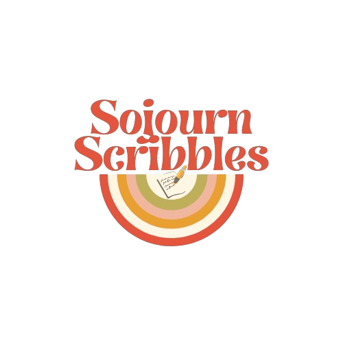

# Welcome to Sojourn Scribbles

## A Travel Journal Blogging website
Sojourn Scribbles brings together solo women travelers from around the globe, offering a platform to share experiences, insights, and camaraderie.  

The responsive website allows registered users to create blog posts (journal entries) and a profile with thier bio and a photo. Users who are not registered are  
free to browse the posts. To make it easy to find content for you, users can filter blog posts by author or country.  

*This project is created as a final portfolio project for the Code Institude.*  

**Built by Katie Jane Coughlan**